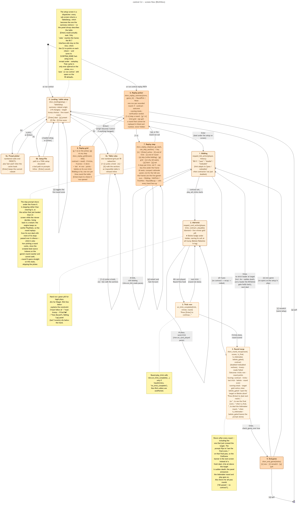

# Replaying a game

`contrai replay` opens a recorded game and plays it back through the live game's own screens,
every hand face up. It answers three questions:

- **Where did it go wrong?** `contrai verify` says round 9 is `suspect`; the replay shows the
  hand, action by action.
- **How did the round go?** One screen lays out all eight tricks and the auction.
- **Why did the AI do that?** For every seat an engine AI played, the replay asks that AI again
  and shows its reasons beside the move.

It writes nothing: no record, no verdict file.

## Quick start

```bash
uv run contrai --record ./corpus                       # play a game and record it
uv run contrai replay ./corpus/games/engine-20260911T120000Z-abc123.jsonl
uv run contrai replay ./corpus/games/obs-0a1b2c3d.jsonl --round 8     # skip the picker
```

Records come from `contrai --record` (games played here) and from the scraper (games watched
online); see [Recording](index.md#cli) and the [`contrai-data` format](../data/index.md). To find
the games one player sat in, and replay them one after the other, use the corpus catalog — see
[Replaying a player's games](../data/index.md#replaying-a-players-games).
The command exits `0` normally, `1` when the record cannot be read or `--round` names no round
that can be replayed, and `2` on a usage error.

## The round picker

The replay opens on one row per recorded round: its number, contract, outcome, the running
totals where the record holds a score line, and the verification verdict, computed live when
the file opens (a `verdicts/` file beside the record may describe an older version of it).

| You type | You get |
| --- | --- |
| `7` | Step round 7 through the game screens. |
| `g 7` (or `g7`, `grid 7`) | Round 7 as a [trick grid](#the-trick-grid). |
| `q` | Leave. A blank answer asks again rather than closing the record by reflex. |

A round the replay cannot drive — its auction never closed, or its eighth trick was never
seen — is still listed, marked `not steppable`: the round you are hunting is often one of
those. Observed games mostly show `partial`, which is the clean verdict for them (a spectator
sees the cards long before a score sheet).

## Stepping through a round

Each stop shows the live game's frame for the action that **just happened**, with a one-line
key legend under it:

```text
┌──── Game score ────┐   ┌──────────────── Round #3 ★ ────────────────┐
│ N-S            224 │   │ Contract: 110 by N                         │
│ E-W             28 │   │ Trump:    ♣ Clubs                          │
│ ·················· │   │ Trick:    1 of 8                           │
│ Target        2000 │   │ Round pts: N-S 0  ·  E-W 0                 │
└────────────────────┘   └────────────────────────────────────────────┘
┌──── Last trick ────┐   ┌──────────── Current trick (#1) ────────────┐
│                    │   │                                            │
│                    │   │                    N ·                     │
│       (none)       │   │ W 7♠ ★ (led)                           E · │
│                    │   │                    S ·                     │
│                    │   │                                            │
│                    │   │                                            │
└────────────────────┘   └────────────────────────────────────────────┘
┌──────────────────────── Debug — all hands ─────────────────────────┐
│ N: Q♣ 8♠ 10♥ J♥ A♦ 10♦ K♦ 9♦                                       │
│ W: K♠ Q♠ J♠ 9♠ K♥ 9♥ 8♥                                            │
│ S: J♣ A♣ 7♣ A♠ 10♠ A♥ Q♥ J♦                                        │
│ E: 9♣ 10♣ K♣ 8♣ 7♥ Q♦ 8♦ 7♦                                        │
│                                                                    │
│ In play: ♠ A 10 K Q J 9 8 · ♥ A 10 K Q J 9 8 7 · ♦ A 10 K Q J 9 8  │
│ 7 · ♣ A 10 K Q J 9 8 7                                             │
└────────────────────────────────────────────────────────────────────┘
┌───────────────────── AI rationale — [w] more ──────────────────────┐
│ W 7♠ concede cheaply                                               │
│   no opening worth making — gave up the cheapest card, sparing     │
│ trump.                                                             │
│   ⚄ drawn at random among: 7 ♠ · 9 ♠                               │
└────────────────────────────────────────────────────────────────────┘
┌─────────────────────────────── Log ────────────────────────────────┐
│ S passed.                                                          │
│ E passed.                                                          │
│ Contract set: 110 ♣ by N.                                          │
│ W plays 7♠.                                                        │
└────────────────────────────────────────────────────────────────────┘
┌────────────────────────────── Prompt ──────────────────────────────┐
│ W plays 7♠.                                                        │
│                                                                    │
└────────────────────────────────────────────────────────────────────┘
[n] next  [t] trick  [r] round  [g] grid  [w] why  [p] back  [q] out
```

From top to bottom: the game score and the round, the last trick and the one on the table, all
four hands and the cards still out, [the AI's reasons](#the-ais-reasons) (only when an AI sat
at the table), the **log** of the last four actions — one per seat, a full turn round the
table — and the prompt naming the action shown. A frame fits a normal terminal: at most 40 rows,
44 with the reasons panel.

### The keys

| Key | Does | Offered |
| --- | --- | --- |
| `n` or `Enter` | Next action. | Always. |
| `t` | Run to the end of the trick. | Always. |
| `r` | Run to the end of the round, where the recap shows. | Always. |
| `a` | **Skip the rest of the auction**: stop on the empty table, the contract set, one `n` before the first card. On a round everyone passed, runs on to the recap. | While bidding. |
| `g` | Show the round so far as a [trick grid](#the-trick-grid); `Enter` comes back to this same frame. | Always, the recap included. |
| `w` | Switch the [AI's reasons](#the-ais-reasons) between the latest decision and the last four. | When an AI sat at the table. |
| `p` | Back one stop. | From the second stop on. |
| `q` | Leave the round, back to the picker. | Always. |

The long forms work too (`next`, `trick`, `round`, `auction`, `grid`, `why`, `back`, `quit`). A
key that is not on offer is refused and the frame repainted with the reason above the keys —
nothing piles up under it. `g` and `w` do not move the replay on: after either, the same stop
asks again.

### Where it stops

- **The deal**, hands face up, before anyone bids.
- **Each bid.**
- **Each card**, except the fourth of a trick: the trick-won frame follows it at once and names
  the winner, so a trick costs **four presses, not five**.
- **A belote or rebelote**, which the engine announces just *after* the card; it gets a stop of
  its own so the announcement is read before the next card covers it.
- **The recap**, after the round. `p` there steps back into the round.

If the record and the engine stop agreeing — a card the rules refuse, a seat out of turn — the
replay says `Round N diverges from the record: …` and stops there; `g` still shows the round as
far as it got.

## The trick grid

`g N` on the picker, or `g` at any stop, puts the whole round on one screen (88 columns, about 25
rows). A round from a real game:

```text
┌─────────────────────────────── Round #5 — all tricks ────────────────────────────────┐
│ Contract 100 ♣ by W   ✓ Made   Round score  N-S 69  ·  E-W 213                       │
└──────────────────────────────────────────────────────────────────────────────────────┘
┌───── Trick 1 ──────┐┌───── Trick 2 ──────┐┌───── Trick 3 ──────┐┌───── Trick 4 ──────┐
│                    ││                    ││                    ││                    │
│        N 7♣        ││       N 9♣ ★       ││       ▸N 7♦        ││        N Q♣        │
│ W 10♠      ▸E J♣ ★ ││ W K♥         ▸E A♣ ││ W Q♦        E A♦ ★ ││      ★ Belote      │
│        S 9♥        ││        S 9♦        ││       S 10♦        ││ W Q♠      ▸E 10♣ ★ │
│ Won E · 30         ││ Won N · 29         ││ Won E · 24         ││        S 7♥        │
│                    ││                    ││                    ││ Won E · 16         │
└────────────────────┘└────────────────────┘└────────────────────┘└────────────────────┘
┌───── Trick 5 ──────┐┌───── Trick 6 ──────┐┌───── Trick 7 ──────┐┌───── Trick 8 ──────┐
│                    ││                    ││                    ││                    │
│       N K♣ ★       ││       ▸N 8♦        ││        N 9♠        ││        N J♦        │
│      ★ Belote      ││ W J♠          E 8♥ ││ W A♠ ★        E K♠ ││ ▸W A♥ ★       E J♥ │
│ W 7♠         ▸E 8♣ ││       S K♦ ★       ││       ▸S 8♠        ││        S Q♥        │
│       S 10♥        ││ Won S · 6          ││ Won W · 15         ││ Won W · 18+10      │
│ Won N · 14         ││                    ││                    ││                    │
└────────────────────┘└────────────────────┘└────────────────────┘└────────────────────┘
┌─────────────────────────────────── Bidding so far ───────────────────────────────────┐
│ #1  E 80 ♣     N Pass     W 100 ♣    S Pass                                          │
│ #2  E Pass     N Pass                                                                │
└──────────────────────────────────────────────────────────────────────────────────────┘
▸ led   ★ won   [Enter] back
```

How to read it:

- **The header** gives the contract and how it ended: `✓ Made` or `✗ Failed` with each side's
  round score; `In progress` with the card points so far when opened mid-round; `All passed —
  no contract` for a round nobody took.
- **Each trick** is the table's diamond: `▸` marks the seat that led, `★` the winner, and the
  footer the winner and the trick's card points — `+10` on trick 8 for the last-trick bonus.
  The eight footers plus the 10 add up to the round's 162.
- **`★ Belote`** sits under the seat on the trick where it was announced — here North's Q♣ in
  trick 4 (belote) and K♣ in trick 5 (rebelote), not on every trick after.
- **Opened at a stop**, the trick on the table reads `in progress` and the tricks not reached
  yet `(not played)`.
- **Bidding so far** is the live game's auction panel, one row per time round the table.

## The AI's reasons

A record keeps every move but not why it was made. When the record says a seat was an engine AI
(`ai:expert`), the replay rebuilds that AI and asks it, at each of that seat's moves, what it
would do and why — from exactly what that seat could see then. The recorded move is still what
is played; the answer is shown beside it.

| Who sat there, per the record | Reasons shown? |
| --- | --- |
| An engine AI of a level this engine knows (`ai:expert`) | Yes. |
| An engine AI of a level it does not (`custom`, a newer engine's level) | No — another AI's words would be put in its mouth. |
| A person at this keyboard (`human`) | No. |
| A player watched online (`observed`) | No. |

When no seat qualifies — a game of people, or one watched online — there is **no panel and no
`w` key** at all.

By default the panel holds the **latest decision**: the seat, the move, the rule that fired and
its one-sentence reason. `w` switches to the **last four decisions**, adding the alternatives
weighed (`over: …`) and any table rule that decided something (`under_trump_exemption = True —
discarded instead of under-trumping`), and back:

```text
┌───────────────────── AI rationale — [w] less ──────────────────────┐
│ E Pass no contract in hand                                         │
│   no trump choice clears the bidding table's opening row — passed. │
│ N Pass nothing to add to partner's bid                             │
│   no external ace and no Hearts complement — the hand adds nothing │
│ to partner's contract.                                             │
│ W Pass no contract in hand                                         │
│   no trump choice clears the bidding table's opening row — passed. │
│ N A♥ open on trump                                                 │
│   our contract: led the strongest trump to draw the opponents'     │
│ trump early.                                                       │
│   over: Ace ♥ · 7 ♥                                                │
└────────────────────────────────────────────────────────────────────┘
```

Two lines flag the answers worth a second look:

- **`⚄ drawn at random among: 7 ♠ · 9 ♠`.** The rules left several cards exactly level —
  equally cheap discards in equally long suits — and the pick among them was a draw. The rule
  named above did not choose *this* card over the others, and asking again may pick another. The
  expert AI draws at random in that one place only; it happens on about 5% of cards.
- **`≠ the AI now prefers K♠ — the reason above is for that`.** Today's AI would not make the
  recorded move; the reason shown is for its own choice. A random draw that covers the recorded
  card does not count. On games the current expert AI played itself this never appears — 2029
  of 2029 decisions agreed across four recorded games — so it is the line to watch when an
  improved AI, or a new version of this one, is set against older records.

The same mechanism will explain any AI level the engine registers, without new code. An AI that
searches by random sampling (MCTS-style) will not give the same answer twice; for those the
reasons will need recording while the game is played, which records do not yet hold.

## How it works

This part is for readers of the code. The replay lives in `contrai_engine.replay` (`controller`,
`player`, `stepping`) and the screens in `view/screens/{replay,grid,debug}.py`; `cli.py`'s
`_run_replay`, `_step_round` and `_show_round_grid` drive them.

**The real engine replays; nothing re-implements the rules.** `ReplayController` seats four
`RecordedPlayer`s in a real `Game`, a `ScriptedDealSource` deals the record's hands, and
`Game.manage_round` runs as in a live game: each seat hands back its recorded action and the
engine's own legality checks either accept it or raise. This is the machinery `contrai verify`
uses too; see [Verifying](index.md#cli).

**A stop comes after the action, not before it.** The engine asks the view for a move only for a
seat whose `is_human` is true, which a `RecordedPlayer` never is. So `SteppingView`, a
decorator over the real view, intercepts the *push* hooks (`on_bid_made`, `on_card_played`, …),
forwards each frame, then blocks for a key underneath it. Every stop therefore shows the action
that just landed, which is the frame worth reading.

**Replay mode is the debug face-up path, without the pacing.** `DebugOptions.replay` shows
every seat's hand and drops every pacing default to zero; an explicitly set
`CONTRAI_AI_BID_DELAY` / `CONTRAI_AI_CARD_DELAY` still wins, so a replay can be slowed down to
watch it run with `r`. The two frames that would wait for Enter in a live game (trick won, round
recap) drop that invitation, since the step keys under them own the keystroke.

**Going back is a restart, and so is picking a round.** The engine keeps only the latest
`PlayState`, and `ScriptedDealSource` indexes on the game's own round counter and cannot seek.
Both operations rebuild the controller, replay the earlier rounds silently (`_replay_quietly`;
a suspect earlier round is cleared and stepped past) and pass over as many stops as needed. A
`RecordedPlayer` derives which action is due from the live engine state rather than from a
cursor, so a restart reproduces the round exactly, in milliseconds.

**Some keys count as a stop and some do not.** Stop numbering is what `p` and the restart count
in, so it must not depend on which keys led there.

- `[a]` passes the remaining bids without stopping and rests where the engine fires
  `on_contract_established`, after the last bid and before `play_all_tricks`. That rest re-shows
  the last bid's stop as a play frame; it is not counted, so `p` from it behaves as from the last
  bid.
- `[g]` and `[w]` are served by `read_step_key` in `replay/stepping.py`, under every prompt —
  the stepper's own, the recap's and a divergence's. It shows the grid or toggles the panel,
  repaints the screen the key was pressed on, and asks again. Neither costs a stop or changes the
  mode (`t`, `r`, `a`). The stepper keeps the bids it has seen for the grid, because
  `Round.auction` is set only once bidding ends.

**The grid's layout.** `view/screens/grid.py` builds it from the live game's own pieces, and
three choices shape it:

- **Four across, two down.** Two across would fit the 70-column frame but run to about forty
  rows; four across is 88 columns and about 25.
- **The leader is `▸`, not `(led)`.** Each trick is the 18-cell diamond of the *Last trick*
  panel, where five more cells for `(led)` do not fit on the shared W / E row;
  `_render_diamond(lead_marker=True)` puts one glyph in front of the seat instead.
- **A belote badge goes on its own trick.** The live table badges a seat for the rest of the
  round because only one trick is ever on screen; with eight on screen that would hide *when* it
  was said. `_belote_badges_by_trick` places each announced pair on the tricks holding its K or
  Q. All eight cells share the height of the busiest one, so the two rows stay flush.

The grid from the picker reaches its round by the same silent replay stepping uses; from a stop
it reads the round as far as it has gone.

**A frame is repainted, never stacked under.** A replay frame once ran to 42–54 rows and its top
scrolled off. It now fits because the keys are a bare line (not a second Prompt panel), the log
keeps 4 lines instead of 5, the full reasons panel is opt-in, and nothing is printed below a
frame already read. `RichView` keeps the arguments of its last in-game frame (`redraw_frame`)
and a callable that repaints whatever screen is up, frame or recap (`redraw_screen`). A rejected
key, a belote stop (whose hook draws no frame of its own), the return from the grid and the
contract rest all repaint through them; a line printed under a frame, such as the divergence
notice, goes through `show_replay_notice` so a repaint draws it again. `test_frame_fit.py`
replays a recorded game and checks every frame: 40 rows, 45 with the reasons panel.

**The reasons are recomputed.** With `explain=True`, `ReplayController` looks each seat up in
the record (`Seat.kind`, `Seat.level`); `ReplayController.explainable(record)` answers the same
question up front, which is how the CLI decides whether there is a panel at all. For an `ai`
seat whose level is in `AI_LEVELS`, the level's strategy pair is built onto the seat's own
`RecordedPlayer`, so it reads that seat's hand, position and team. At each move the seat asks
the strategy, keeps the recorded move, and returns a `ReplayedBid` / `ReplayedCard` carrying
the strategy's rationale plus `preferred`, set when the strategy would now choose otherwise.
The global random generator is saved and restored around every question, so asking changes
nothing, and `contrai verify` never explains. The draw flag is the expert AI's own:
`Rationale.drawn_from`, set by the card play's tie-break (see
[Explainability](../ai-ladder/rule_based.md#explainability)). The panel reads the projection
`debug_state.last_decisions`, which also gives each decision its seat.

The tests that pin the behaviour: `test_replay/test_stepping.py` (stops, keys, restarts),
`test_skip_auction.py` (`[a]` against the real engine), `test_controller.py`'s
`test_the_expert_explains_its_own_game_without_a_disagreement`, `test_frame_fit.py`, and the
screen builders' own files under `tests/test_view/`.

The flow between the picker, the stepped frames and the grid is part of the CLI's screen
diagram (screens 6–8; [source](../diagrams/state_cli_screens.mmd)); the replay-and-verify
sequence is [`seq_replay.puml`](../diagrams/seq_replay.png).


