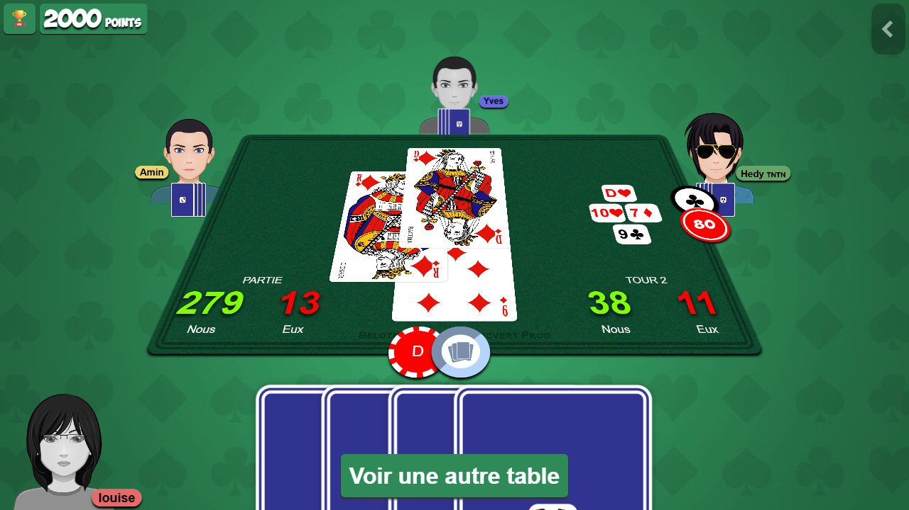

# contrai-scraper

Playwright spectator-mode scraper for online Coinche games (auth required).

**Stack:** Playwright async, Python 3.14, uv. Storage: SQLite (default, schema TBD).

## Layout

| Module | Role |
| ------ | ---- |
| `contrai_scraper.config` | Target URL and scraping-account credentials. |
| `contrai_scraper.session` | Lobby navigation: `log_in` → `open_spectator_mode` → `find_tournament_table`. |
| `contrai_scraper.observer` | Watches a seated table: `get_players`, `get_current_round`, `observe_game`. |
| `contrai_scraper.cli` | `contrai-scrape` console script wiring the two phases together. |

```bash
uv run contrai-scrape
```

`run.py` sits outside the package: it is a parked login experiment against a different site (`belote.com`), kept for reference and not importable.

## Current flow (v1)

login → Online → Spectator → Contree → Tournament → identify players via `#nord/#sud/#est/#ouest` → poll `#tour` for new rounds.

```plantuml format="svg" source="seq_scraper.puml"
```

`FUTURE LOGIC` placeholders (bidding observation, gameplay observation, SQLite persistence, DB-based de-duplication of already-scraped players) appear as dashed `<<future>>` arrows on the diagram and map to the comment block inside `observer.observe_game`.

## Pending

- Bidding observation
- Card-play observation
- Game persistence (schema design)
- Multi-table orchestration
- Rate-limiting / ToS considerations

## Screenshots

Reference DOM captures of the target site live under `screenshots/`:

- 
- 
