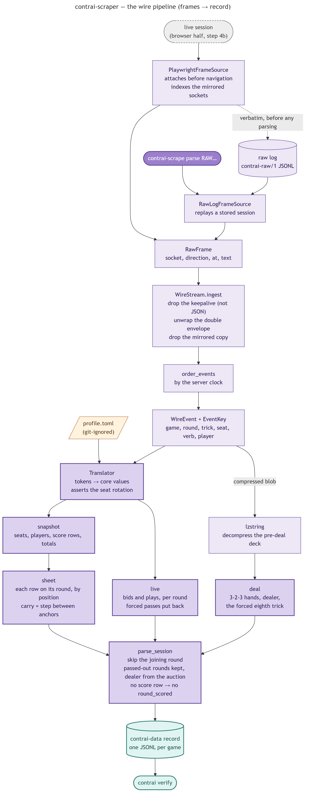
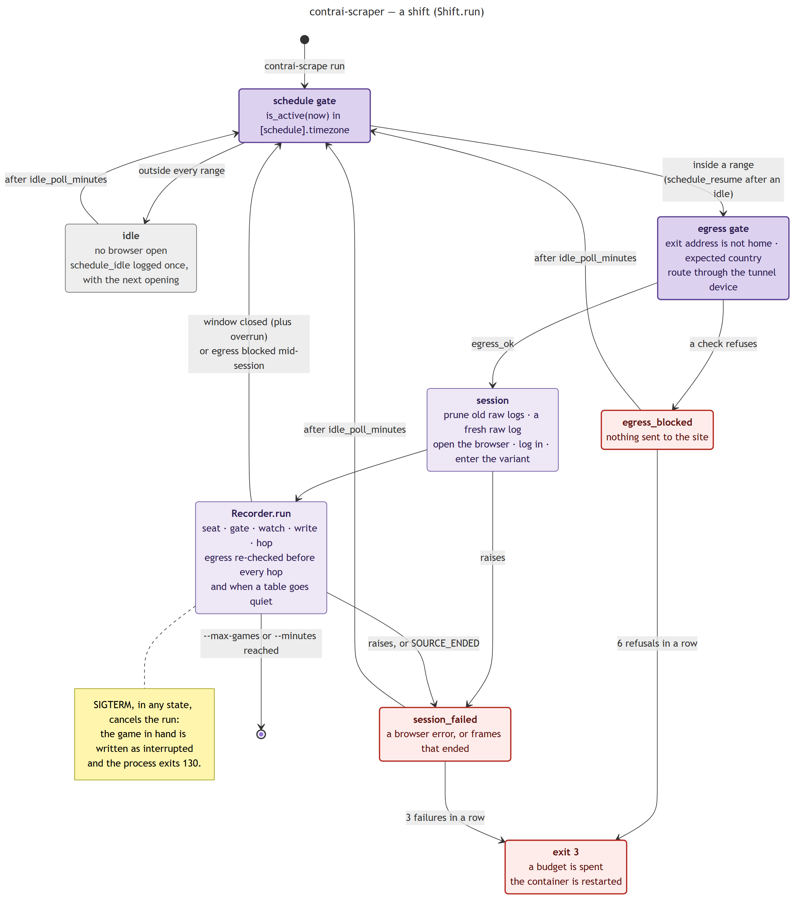
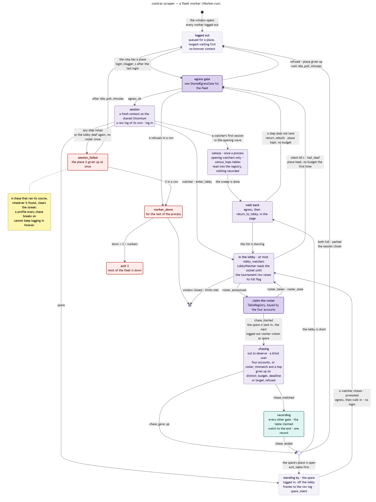
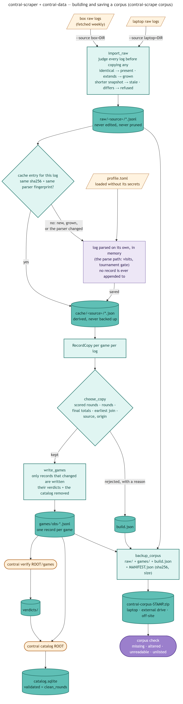

# contrai-scraper

Playwright spectator-mode scraper for online Contrée games (auth required).

**Stack:** Playwright async, Python 3.14, uv. Output: `contrai-data` records — one append-only
JSONL file per game, the same format the engine writes, so a scraped game and a played one are
read by the same code.

Two ways to watch. `contrai-scrape run` is one account sitting wherever the server seats it, which
is always a game already under way. `contrai-scrape fleet` is several accounts on one browser,
waiting in the lobby and chasing each tournament game to its table from its first card — see
[The lobby](#the-lobby) and [Fleets](#fleets).

Site specifics — the target URL, the scraping account, every selector the browser clicks, every
token the wire speaks — live in a local `profile.toml` that is never committed. Code and docs
describe *what* each step does, not *where* it clicks; do not add the site's name, its DOM ids
or screenshots of it to any tracked file. The test suite runs against an invented vocabulary for
the same reason.

## Layout

| Module | Role |
| ------ | ---- |
| `contrai_scraper.profile` | `profile.toml` → frozen, validated sections. The only place the site is named. |
| `contrai_scraper.accounts` | `accounts.toml` → the labelled spectator accounts a fleet logs in with, one per worker. |
| `contrai_scraper.exceptions` | `ScraperError` / `ProfileError` / `WireError` / `ParseError`. |
| `contrai_scraper.frames` | `RawFrame` and the two frame sources: a live Playwright page, or a stored raw log. |
| `contrai_scraper.rawlog` | The verbatim per-session log: `RawLogWriter`, `read_raw_log`, `raw_path`. |
| `contrai_scraper.wire` | Envelope, keepalive, de-duplication, composite key → `WireEvent`. |
| `contrai_scraper.lobby` | `LobbyWatcher` — the lobby's socket events → a `LobbyRoster` the moment a tournament game starts. |
| `contrai_scraper.lzstring` | The LZ-String base64 codec the deal payload arrives in. |
| `contrai_scraper.parse` | `translate`, `deal`, `snapshot`, `sheet`, `live`, `session` — wire events → a record. |
| `contrai_scraper.browser` | `Spectator` — the only module that touches a page. Login, the walk, the hop, the two panels. `open_browser` / `open_session` — one Chromium, one isolated context per session. |
| `contrai_scraper.recorder` | `Recorder` — the table loop: seat, gate, watch, write, hop. Imports no Playwright. |
| `contrai_scraper.registry` | `TableRegistry` — a fleet's claims: a chase by roster, a table by id, and the census of tables seen. |
| `contrai_scraper.schedule` | `Schedule` — daily ranges in a named timezone; answers "is it open now" and "when does that change". |
| `contrai_scraper.egress` | `EgressGate` — exit address, country and route device, checked before the site is touched. |
| `contrai_scraper.shift` | `Shift` — the outer loop: schedule gate, egress gate, one browser session and raw log per window, failure budgets. |
| `contrai_scraper.fleet` | `Fleet` / `Worker` — the same gates for N workers on one browser, waiting in the lobby and chasing each game; budgets per worker. |
| `contrai_scraper.rota` | `Rota` — a fleet's roles: who waits in the lobby, who stands by logged in as the spare, and who is logged out. |
| `contrai_scraper.health` | `HealthLog` and `Counters` — one JSON line per transition, on stderr. |
| `contrai_scraper.cli` | `contrai-scrape`: `run` (the default), `fleet`, `check-profile`, `parse` and `corpus build` / `backup` / `check`. |

```bash
uv run contrai-scrape run --profile profile.toml --headless    # watch tables
uv run contrai-scrape fleet --profile profile.toml --accounts accounts.toml --workers 5 --headless
uv run contrai-scrape check-profile profile.toml               # validate before a shift
uv run contrai-scrape parse RAW... --profile profile.toml      # re-parse stored logs
uv run contrai-scrape corpus build --profile profile.toml --corpus ROOT --source box=DIR
uv run contrai-scrape corpus backup ROOT --to DIR                # save it; corpus check ARCHIVE
```

`run` takes `--max-games N` and `--minutes N`, and `--headless` / `--headed` override
`[browser].headless`. A bare `contrai-scrape` is still `contrai-scrape run`, but `run` needs a
profile, so it now fails with usage rather than launching anything.

## Pipeline

Everything between a socket frame and a record, in one direction, each stage knowing only the
one below it.



*Rendered from [`flow_wire.mmd`](../diagrams/flow_wire.mmd).*

Three properties of the traffic shape the wire layer. It is **double-wrapped** — the frame is
JSON whose payload is itself a JSON *string*. It is **mirrored** — a second connection repeats
every event, so half of what arrives is a duplicate. And it is **interleaved with a keepalive
that is not JSON at all**, which a parser assuming otherwise trips over roughly once a second.

Four more shape the parser, and all four are cases where the wrong reading produces a record
that is well-formed and wrong:

- **The seat map is checked by rotation, not by name.** The observed tables turn clockwise,
  which is what the `tournament` preset says, so each on-screen seat maps to the compass seat
  it shows. The profile owns the map and `Translator` asserts that the site's rotation walks
  the seats in the preset's direction — a map with its side seats crossed passes every spot
  check and still turns the table backwards.
- **A double's payload names the player being doubled**, not the doubler. The doubler is the
  event key's actor; taking the payload's owner credits the double to the side it was aimed at,
  and the round still looks legal.
- **The join snapshot describes the last *completed* round.** The round in progress when the
  session joined is skipped, never reconstructed, so an observed game's hands are always
  `dealt_from_deck`.
- **A sweep is a fact about the tricks, not about the bid.** A declaring side that takes all eight
  tricks off a numeric, un-doubled contract has made an *unannounced* slam, and the record says so
  — the round's plays are replayed through core's own trick-winner rule to decide it. Reading the
  contract alone would write `none`, which the round's own plays contradict and which `contrai
  verify` calls `suspect`.
- **The pre-game draw is not a round.** Before the first deal each player draws a card to seat the
  table, and each draw arrives keyed at round 0 with a real card and its place in the deck — cards
  that belong to no hand. It never wears a deal's key, so it cannot pass for one, but a stage taking
  "every keyed event of the table" would fold four stray cards into the record. `collect_rounds`
  leaves round 0 out by name, and the draw's verb (`[wire].draw_verb`) wherever it is addressed; the
  draw itself goes unremarked, and anything *else* the rule sweeps up is a parse note. It matters
  only for a game watched from its first card, which `run` never sees and a fleet always does. Do
  not add a "require a bid before accepting a deal" guard instead: the first bid has been seen
  1.8 s and 24.6 s after the deal.

One thing the wire leaves out entirely is a **forced pass**. The table skips a seat whose only
legal bid is a pass — the doubler's partner, the partner of a Slam bidder, everyone after a
redouble — spending its sequence number and transmitting nothing, so an auction read literally
ends short and projects as unfinished. `restore_forced_passes` puts each one back where core's
own legality says it falls and checks it against the gap it left in the numbering; a gap on a
seat that had a choice is a lost bid, and that round is skipped with a note instead of repaired.

The raw log is what makes all of this correctable. Frames are stored verbatim *before* anything
is interpreted, so a parser fix applies to games already watched — `contrai-scrape parse` is that
re-run, and it is the same code path a live session takes. Like the live gate's `already_recorded`,
it leaves a game whose record already exists under the output root untouched and says so: the
writer appends, so parsing into such a root once wrote a second header and every round twice. A
re-parse that should replace records goes to a fresh root, or through `corpus build`.

A re-parsed record is stamped with the instant its game was last heard from: the latest server
clock (`received_ms`) among its visit's events, else the raw log's own `started_at`. The live
recorder stamps a record when it writes it, which is that same moment, so a re-parse keeps the
date the game was played on rather than the date of the re-parse — and parsing one log twice
gives the same bytes, which is what lets `corpus build` rebuild without drift.

A panel read is filed in that same timeline, and stamped with `FrameSource.elapsed` — the clock
frames themselves are stamped on, so the two are comparable. It matters because a DOM reading is
taken *away* from the socket: the gap between a panel's stamp and the frames on either side of it
is how far behind the page the reader was when it looked, which is the one thing an unstamped line
could never say. A replay reports the stamp of the last frame it handed out, so a re-parse files
its readings on the instants the live session saw rather than on the speed of the machine
re-reading it.

It is the same path only once the log is cut the way a live session cuts it. A session hops, so its
log holds every table it looked at — two to twelve of them in the logs measured on 2026-09-16 —
while the parser assembles exactly one game out of whatever it is handed. `split_visits` makes that
cut first: a join snapshot naming a new table opens a visit, and an in-game event is filed by the
game its own key names rather than by when it arrived, because a table's last frames can still be
in flight when the hop lands. `parse` then writes one record per visit that held a game, and says
how many visits a log carried. Without the cut a re-parse merged tables — rounds whose plays
belonged elsewhere were dropped as undealable, records took whichever game id came first, and
records appeared for games no recorder ever accepted.

The live path makes the same cut, as a check rather than a split. A session buffers one table
because it seats one table, but that is true only by construction: a seat taken one table behind
the page once filled a buffer with 108 events of another table against 59 of its own, and the
parser merged both into a single record. So `Recorder._write` runs `split_visits` over the buffer
and refuses the record, logged as `record_refused`, when it holds more than one game key
(`several_games`) or another table's snapshot (`several_tables`). A snapshot alone is enough: it
would lend the record its seats and its score rows. It refuses rather than splits because a second
game that arrived without a snapshot of its own leaves nothing to say which half was the table
seated, and the raw log still holds every frame for `parse` to cut apart. The pre-game draw is keyed
to the game it opens, so a table caught from its first card is still one game.

Both paths also leave out a game that holds no round, by the same count (`round_count`). `parse`
always has: most such visits are tables a gate refused seconds after arriving. The recorder now
does too, logging `record_skipped` with `reason` `no_round` instead of writing a record with no
round and a null first round — which is what a chase that found its table seconds before the time
limit used to leave, counted towards `--max-games` as if it were a game.

A game also gets one record, ever. A record file is opened for appending, so a game seated, left
and offered again — a spectator hopping away, or a fleet's startup worker taking a table another
left — used to have the rest of it appended as a second record in the same file: two headers, and
the first visit's rounds twice. The recorder now refuses it twice over. At the gate, from the wire
alone, a table whose game already has a file is refused as `already_recorded`: the join snapshot's
round block is keyed by the site's own game id, the same one the in-game events carry and the record
file is named after (they agreed on 6,041 of 6,052 snapshots across the fleet's and the box's raw
logs; every disagreement was a join at a game's boundary or a late event of the table just left).
And at the write, since a snapshot at a boundary can name another game than the buffer holds, a
record whose file already exists is not written: `record_skipped` with `reason` `already_recorded`,
the raw log keeping every frame. `parse` writes as it always did.

`parse` also applies the one gate the wire can answer: a visit whose opening snapshot does not say
its table is a tournament is left out, as the live gate leaves it. Refusing a table is not leaving
it. The site chooses where a spectator sits, and while no tournament table is open it seats the
spectator back at the table just refused, hop after hop — for 15 and 19 minutes at the start of two
V5 sessions, one hop every `snapshot_timeout_s` — so the log holds a whole game nobody watched. Six
V5 records were made of such games before the check, among them obs-a5dae556, whose table scores in
another mode (no contract points, marks rounded to ten) and read as 11 `suspect` rounds. The gates
that need the page — the options panel, the scoreboard's side — cannot be re-run offline. Every
visit a V5 log held under a variant this ruleset cannot name — the 35 reported as "could not be
read" — was one of those tables too, and is now counted with them on the log's summary line.

One limit on "the same path" is worth knowing before a log is used as evidence. The log is
de-duplicated by frame identity and never reset, so the mirrored connection's copy of a frame is
not in the file — a replay is faithful for the parser, which drops those copies anyway, but it
cannot reproduce a fault whose trigger *is* a mirrored copy.

The join snapshot's running totals are read by the profile's team letters alone: the block holding
them may carry other things beside them, such as the per-round rows. A mid-game join whose totals
cannot be placed on a side is refused as a `ParseError`, because the record has to say what the
score was when watching began. A score row reads as made when the side it names as the winner is
the declaring side; the row's status token is only consulted when a row does not name both.

A held dispute (§7.5) reads as made on the site's row while marking its declarer 0 / 0, so that pair
is recorded as `held`. Its points are paid into the next winner's running total and appear in no
row, so each round's `carried_over` is inferred, by `parse.sheet`. It reads the score sheet **by
position**: each snapshot is an *anchor* — after R rows the totals were T — and every game adds
one of its own, 0 / 0 after no row at all. A round's carry is the step between the anchors either
side of its row: what the totals moved by, less the row's made, announced and credited belote
points. Where no read stated the totals on both sides of the row the carry is `null`, not zero; a
negative step cannot be a payout, so it is `null` too, with a note. Keying the step on the row
count rather than the round number is what lets round 1 of a game seen whole start from 0 / 0, and
keeps a join just after passed-out rounds on the row it really joined at.

A seat taken mid-round, or a boundary request the site never answers, leaves **several rows**
between two anchors, and no single row's step can be read. The span is still read, conservatively.
A carry is a payout, never negative, so a residual of zero on both sides proves every row in the
span carried nothing, and each gets 0 / 0. A positive residual means a pot was paid somewhere
inside, and attributing it to a row would assume the very rule `contrai verify` checks, so every
carry in the span stays `null`. A negative residual can only mean misplaced rows: `null`, with a
note. Across the V5 corpus this leaves no round with a `null` carry (590 before) — 15 rounds carry
a pot, 161, 181 or 480, and every other round 0 / 0 — and across the fleet's ramp runs 3 of 100,
all in one span whose pot was paid inside it.

The sheet refuses rather than guesses. Reads that contradict one another — rows that disagree, a
round on two rows, a played round left without one, rows out of the rounds' order — place no row
for the visit, and two reads stating different totals after the same number of rows make that
count a *barrier* no carry is read across. Each leaves one note; neither happens in the V5 corpus
or the fleet's ramp runs.

A **passed-out round** — every seat passes and the cards are dealt again — has no row on the site's
score sheet, yet it still advances the round counter. A snapshot's rows therefore cannot be walked
back one per round number: below a passed-out round every row would land one round too high. That
fault stayed hidden while an earlier snapshot, taken before the passed-out round, filled those rounds
first, and it reached records once boundary requests went unanswered (two `suspect` games in the
10-worker ramp). `passed_out` recognises such a round on the wire — bids but no play, every observed
bid a pass, and either four of them or a later round begun, which covers an auction the session
joined part-way — and the walk steps over those numbers, so each row lands on a *played* round. A
snapshot's round index names the newest *scored* round and never a passed-out one: after an
all-pass round 9 the next read still says 8. The walk starts there and stops at the first round
number the visit saw nothing of, since the rows below it belong to rounds before the join or across
a gap in the watching, and no read of this visit can say which. Passing out moves no total, so a
passed-out round stands at the anchor for the rows written before it.

A passed-out round is also **recorded**, not dropped: four seats looked at known hands and none bid,
which is bidding data like any other. A played round's dealer is resolved from its plays, and this
one has none, so the dealer comes from the auction instead. Nobody is forced to pass an empty
auction, so the first transmitted bid is the first speaker's and the dealer sits just before it. A
round with its deal, exactly four passes and no play is written as its deal, the four passes and an
`all_pass` score line: every component 0, `carried_over` 0 / 0 — under the held rule a dispute's pot
goes to the next *contract's* winner — and the totals standing before it where those are known.

Each round the parser still skips says why, in this order: no deal was transmitted (the joining
round); the record ends before the round did (the visit's last round, short of its plays, with no
score read reaching it); no card of the round was observed (a round seen only in part); and "no deal
rotation fits the observed plays", now said only where plays exist and fit no rotation — a real
inconsistency rather than an empty round.

The eighth trick never reaches the wire, and no row says which side took it: the ten-point bonus
is folded into the taker's card points. It is still recorded. The rebuilt trick's winner by core's
rule is written as `last_trick` only when the row's card points are exactly the tricks' piles with
the bonus on that side, so the claim rests on the site's own split rather than on the parser's
reconstruction alone. A sweep is written for the sweeper, since the row states the flat substitute
in place of a pile. Any other disagreement leaves `last_trick` `null` and the verifier's
card-points check to say what is wrong. Across the V5 corpus 3858 rounds agree, 338 are sweeps and
none disagree.

## Profile

One TOML document, git-ignored; `profile.example.toml` in the package is the committed schema,
placeholders only. It is read strictly: an unknown section, an unknown key, a wrong type or an
incomplete token map is a load error, so a site change surfaces as a refusal rather than as
silently wrong data.

| Section | What it holds |
| ------- | ------------- |
| `[site]` | Where the site lives, and which language it answers in. |
| `[account]` | The spectator account. Values may read `env:NAME` instead of holding the secret. |
| `[browser]` | Headless or headed, slow-motion, screenshot-on-error. |
| `[selectors]` | One entry per UI step; a list means "try these in order". `seat_element` is a template filled with a seat token; `scoreboard_cell` is looked up inside each scoreboard row; `options_id_element` and `options_state_element` inside each option row. `rail_show` is optional: it names the control that brings a table's collapsible panel rails back, filtered on visibility so it is clicked only while they are away, and it is clicked again before every attempt at a panel control. The seven lobby keys (`mode_new_games`, `lobby_*`) are optional as a group — all or none — since only a fleet goes to the lobby. |
| `[wire]` | How a frame is recognised, unwrapped and keyed. `draw_verb`, optional, names the pre-game draw's verb. |
| `[wire.events]` | The three event names the parser reacts to, plus the lobby's own, `lobby_table` — optional, and only together with the lobby's paths below. |
| `[wire.fields]` | Dotted paths, one per logical field the parser reads. The set of names is fixed, bar the lobby's four (`lobby_hash`, `lobby_seats`, `lobby_seat_account`, `lobby_full`), which are all or none. |
| `[wire.tokens]` | The site's vocabulary mapped onto core values — cards, seats, team labels, bid values. |
| `[rules]` | The core preset, plus the table options the browser half checks. |
| `[recorder]` | The loop's own thresholds — hop, watchdog, heartbeat, seat timeout. Policy, not site vocabulary. |
| `[schedule]` | When the scraper may watch: a timezone, daily ranges that may cross midnight, and how long a closing range lets the game in hand run on. |
| `[egress]` | The gate before any site traffic: the home address (through the environment), the expected country, an echo service, and the tunnel device the route must use. |
| `[output]` | Where records and raw logs go; both roots resolve relative to the profile, and both name the same directory. |
| `[fleet]` | Optional, read by `fleet` alone: how many workers (at most 25), their login stagger, a chase's distinct-table budget and deadline, how old a roster may be, the registry's and egress gate's timings, the startup census, the rota's `lobby_watchers` (default 2) and `spares` (default 1), and the startup phase's `bootstrap_enabled` (default on) and `bootstrap_scan_s` (default 60) — these four a profile may leave out. |
| `[privacy]` | Inputs to the pseudonymisation step, which is not built yet. |

The `env:NAME` values are read only by the commands that reach the site. `parse` never does, so it
loads the profile with `load_profile(path, resolve_secrets=False)`: every `env:` value is kept as
its own text, unread, and every other key is validated as strictly as before. A laptop re-parsing
logs therefore needs none of the account's variables set. The home address's IP check is skipped
for such an unread value alone, and a live load refuses a variable whose value is itself an
`env:` indirection, so an unread-looking address can never reach the egress gate.

A fleet logs in with several accounts, and they do not multiply the profile. They live in a second
git-ignored document, `accounts.toml` beside `profile.toml` (`accounts.example.toml` is its
committed schema): one table per account, named by its **label**, holding the same `email` and
`verification_code` as `[account]` and read as strictly, `env:NAME` included. The label is what a
worker's health lines carry instead of the address, so it must be a plain token such as `bot01`,
and a label that is not one is refused by its position rather than repeated. Two labels on one
address are refused too: two sessions on one account would sign each other out. The profile's own
`[account]` stays, and `run` still reads it.

Two exceptions are worth knowing. `ProfileError` means the document is wrong — edit it.
`ParseError` means the wire said something the document does not describe — investigate the
site. They have different fixes, which is why they are different types.

## The table loop

login → online mode → the variant → wherever the server seats us → gate the table → watch one
game → write the record → ask for another table.

```plantuml format="svg" source="seq_scraper.puml"
```

Three measured facts shape that loop, and each of them removes something an obvious design would
have had:

- **There is no table list.** The server decides where a spectator sits, so nothing browses;
  "another table" is a request, not a choice. The walk ends at the variant.
- **The exit control leads to the menus, not to another table.** It leaves the table for the
  online menu, one screen past where the walk in starts, so a walk that begins with the mode menu's
  first button finds it hidden every time. That is why it was once recorded as unrecoverable. So the
  only hop is the table control, `Spectator` has no leave operation, and a session that cannot
  reseat rebuilds its browser context. The exit serves one route only: a fleet worker's way back to
  the lobby (see [The lobby](#the-lobby)).
- **The boundary score read is a wire read.** The client can ask for table state without leaving,
  and the answer arrives on the socket as a fresh join snapshot — 0.21 s against 2.58 s for the
  rendered panel, with no replay cost. The panel is the fallback, and it is evidence for the raw
  log rather than a score the parser can use.
- **A score read counts when its snapshot arrives, not when its request goes out.** The site
  acknowledges some state requests and never answers them — 77 of 218 in the 10-worker ramp, 35%,
  in 8 of 9 sessions — and a counter of requests sent reported none of it. Answers come fast or
  never: every answered request came back within 0.22 s. So a request is pending for
  `STATE_ANSWER_S` (5 s) until a join snapshot of *this* table arrives, which is what
  `score_reads_wire` now counts. An unanswered attempt is logged `state_unanswered` — the table, the
  frame source's socket the request went on (learnt from our own sent frame) and the attempt — and
  counts in `score_reads_unanswered`. The first attempt is retried once on another socket:
  `SEND_SCRIPT` sends on the newest open socket matching `[wire].socket_url_pattern`, which was never
  the one the page itself switched to the table's room, so the retry avoids it. That is a measured
  experiment, not a known cure; how often the retry is answered is read from the next live run. After
  two silences the panel is read, best-effort: a panel that fails costs `score_reads_failed`, never
  the game in hand. A request still pending at the next boundary is logged unanswered and replaced,
  since the new one covers the same rows. The closing request takes the same two attempts and stops
  at this table's snapshot, with no panel after them: the end screen covers the page.

A session *is* a browser context — its own cookies, so its own login, and its own sockets, so its
own frames — opened by `open_session` on a browser `open_browser` launched. The browser is the
expensive half and the context the cheap one, so several sessions can share one Chromium and
rebuilding one of them costs the others nothing; `open_spectator`, the single-session path `run`
takes, is simply one of each. The order inside a session is load-bearing: the script that keeps the
page's sockets is added to the context before its page exists, and the frame source listens before
anything navigates, or the join snapshot describing the first table is gone.

The walk follows the site's timing, not only its markup. It lets the landing page settle before
probing for the first-visit tutorial — and, since a cold browser has been measured drawing it after
that one look, dismisses it and retries once when the login entry refuses a click — opens the
address form through its own entry, and, because
the first-use pledge can be drawn a moment after it was looked for, answers it and retries once
when the spectator menu refuses a click.

**A selector that matches translated text is a latent fault, and it fires the first time the site
is reached from somewhere else.** The site chooses the interface language for the visitor, so the
same login page that renders in French to one exit renders in English to another — measured on
2026-09-18, when a deployment behind a Swiss exit could not find a field the laptop had been
typing into for days, because the profile matched that field by its French placeholder alone. The
DOM had it all along, under a different word. Prefer a stable attribute, an id, or the site's own
i18n key, all of which survive the change; where a text match really is the only handle, give it a
locale-independent alternative, because `[selectors]` takes a **list** and tries each in turn. The
entry beside it was already written that way and walked straight through the same page.

Panel controls get more than that, because they sit on rails the table slides away on its own.
Playwright already retries a click for its whole timeout, so a control covered for a moment by one
of the table's transient dialogs needs no help. What it cannot survive is the two together: the
click waits on the covered control, the rails leave under it mid-wait, and the button it is still
waiting for is now off-screen with no way to ask for it back. So a panel control is offered
`PANEL_ATTEMPTS` shorter attempts instead of one long one, and `rail_show` is clicked again at the
top of each — the reveal was never wrong, it was simply asked once, in front of a wait it could
not reach into. Measured on 2026-09-16: the options button covered by a modal host while the rails
were in, dead after 10 s; the same click landed 0.9 s after the rails were revealed a second time.
The table hop is one of these controls. It reads like a menu step and took the single-shot path
until 9B's 24-hour run ended two sessions on it: a recorder that hops promptly finds the rails
still out, and one that watches a table to its end does not. The reveal itself is best-effort: the
toggle is clicked with a `RAIL_REVEAL_TIMEOUT_MS` (1 s) wait and a miss is ignored, because a rail
that slides back in between the look and the click hides the toggle, and waiting out the full step
on it once turned a walk back into a rebuilt session in the 10-worker ramp.

When a browser step does fail, `[browser].screenshot_on_error` saves a PNG and the page's DOM
beside that session's raw log. An error names the profile key it was on and nothing else, which
says *which* selector stopped matching but never *why* — and the why is routinely something no
selector can express: a dialog over the control, a rail that slid away, a font that did not load.

`check-profile` keeps the same evidence, under `<raw_root>/raw/check-profile-<id>.png` and `.html`,
and the failed line says where. It matters more there than in a run: `check-profile` is what is
reached for when a deployment will not start, often on a host administered through a console, where
the browser is gone by the time the line is read and the walk cannot be repeated by hand. The line
itself is never replaced by the diagnosis — an unwritable raw root or a page that has already gone
leaves the failure reported exactly as it was.

The server seats `check-profile` wherever it likes, so its table is not always a tournament, and
every other table chooses its own options. The options panel is still read there, so a selector the
site broke still fails, but it is held against `[rules.options]` only on a tournament table;
elsewhere the line reads `not compared`, and a re-run lands on one. No line names the account: under
Compose this output reaches the journal.

A hop moves the page long before the reader hears about it, and a gate judging the wrong snapshot
reads one table's options and scoreboard against another's. Measured across 2026-09-16 and
2026-09-17: over twenty table joins the new table described itself between 0.05 s and 0.23 s after
the page joined its room, while a gate and its hop together took 1.8 s to 7.2 s — two DOM panel
reads against a quarter-second wire. So the snapshot waiting in the queue when a gate ends is
routinely the one for the table just left: ten of thirteen gates across those two sessions were
judging a table the page had already been moved off, and every one of those snapshots had arrived
*before* the hop that preceded its gate. The site was never the one moving the spectator — the
reader was behind its own clicks.

The lag starts at a game boundary. The snapshot answering the closing request is read by the
drain, which never offers it to a gate, so the mirrored copy still queued on the other connection
is a first sighting at the next seat: the table whose game has just been written is judged again,
and from there each gate hands the offset to the next. Both sessions show it — the first gate
after each `game_recorded` judged the table just recorded.

So the table just left is remembered by name, and a snapshot naming it is refused and logged as
`stale_snapshot` instead of judged. Frame identity cannot do that job: at a boundary the stale
snapshot is a copy of one already consumed, and at every later gate it is a table's own first and
only snapshot. The rule is "not the one we just left", never "none seen before" — the pool is
small enough that a table comes round again within a few hops — and a table genuinely re-offered
twice running is left to `snapshot_timeout_s`, which ends as a `seat_timeout` and one more hop.
None of the twenty joins measured re-offered a table immediately.

Draining the queue is the other half of it, and not a substitute: anything the page has **already**
queued is taken first, so a page several tables ahead is not followed one gate at a time, and the
newest readable table that is not the one just left is the one gated. It never waits, so a reader
that is keeping up pays nothing; what arrived after that newest snapshot is handed to the buffer
rather than dropped, because it is the beginning of the table about to be judged.

The states, in order: reset the buffer and the stream, wait for a join snapshot, refuse a table
whose snapshot this profile cannot read, refuse one another worker of a fleet already holds
(`claimed_by_other`, below), refuse a game already recorded (`already_recorded`, above), refuse one
that is not a tournament or is already `hop_after_rows` rounds old, refuse one whose options
disagree with `[rules.options]`, check that the panel's *us* is the south seat's side, then watch.
A deal opening a new round triggers the boundary read; the table's own game-over flag closes the
record; an observer-left flag alone does not, because it says the spectator stopped watching and
not that the game finished. A table that plays nothing for `stale_after_s` is written as
`abandoned`, and an interrupted process writes what it saw as `interrupted` — neither is visible
to the wire, which is why `parse_session` takes an `end_reason` the caller can state.

The first deal after seating triggers the read too, unless it opens the round right after the
seating snapshot's newest scored round: only then is that snapshot the read. A seat lands mid-round
in 629 of 706 V5 visits and 11 of 30 fleet visits, and 557 and 10 of those never got a snapshot
stating the totals before the first round watched — which leaves that round's carry to span
inference at best. Judged on round numbers rather than on "the first deal seen", the rule also
holds when the catch-up drain handed a deal over before the watch began. It costs at most one
request per game: about 13% more requests for `run`, about 5% for a fleet.

The game-over flag outranks both. Seen anywhere in a game's updates, it writes `target_reached`
whatever followed it — the site sends the spectator back to the menu once a game ends, and that
later observer-left flag used to win — and whatever reason the caller stated. When the game's final
read never came, its totals are written `null`, not the newest read's: those miss the last round,
and a catalog would derive a winner from them. In the 10-worker ramp, 8 finished games were written
`observer_left` behind a closing request the site never answered; a re-parse writes them
`target_reached`.

The orientation check compares the newest round *both* readings describe, not the last row of
each. The panel is opened a moment after the join snapshot arrives, so the table can score a round
in between; holding one reading's last row against the other's then compares two different rounds
and refuses a table whose sides line up. The health line carries the round index and both row
counts, so a mismatch says whether the numbers even describe the same round.

A snapshot that will not parse is a rejection and not a failure. The site runs variants the
`tournament` ruleset has no vocabulary for — all trump is the one that was met — and the options
gate that refuses such a table runs *after* the snapshot is read, so a table we never wanted would
otherwise end the session and spend a slot of the shift's failure budget. It is logged as
`table_rejected` with the token the reader objected to, and it counts in `tables_rejected`, so a
profile that has genuinely drifted shows itself rather than hiding as a hop.

A shift can hand the recorder a seat deadline — after it no new table is taken, while the game in
hand runs on — and an egress gate, checked before every hop and when a table goes quiet: behind a
refused egress the game is written `interrupted`, not `abandoned`.

The buffer is what keeps one parser from becoming two. A seated table's events are collected
and handed to the same batch parser `contrai-scrape parse` uses, so "a round is complete at
twenty-eight plays" and "skip the round in progress at seating" exist once. It is reset at every
seat: table discovery joins each candidate and emits one snapshot per visit, and keeping the first
would seat four players from a table we left.

In a fleet, several recorders share one `TableRegistry`, because none of them chooses its table and
two are routinely seated at the same one. That is worse than waste: both would write
`games/obs-<game_id>.jsonl`, and a record is opened for appending, so two streams would interleave
into one file that is well formed and wrong. So the registry's refusal, `claimed_by_other` with the
holder's label, is the first gate — the only one that prevents corruption rather than waste — and
every other gate still runs after it. A recorder holds the table it watches, refreshing the claim on
every frame, gives it up when it next seats or stops for any reason, and adds every table it judges
to the fleet's census. Two keys do two jobs and are kept apart: the lobby names who is about to play
but not where, so a chase is claimed by its **roster**; a seated table carries its own id, so
exclusion is claimed by **table id**. Every worker runs in one event loop and no claim awaits
anything between its check and its set, so a claim is atomic without a lock. Claims also expire
after `claim_ttl_s` unrefreshed — not the mechanism, only the backstop for a worker that wedged
holding one — and a late release never frees a claim someone else has since taken.

`HealthLog` writes one JSON object per line to stderr — a transition per line plus a counter
heartbeat — so a shift is `journalctl`-readable without a parser being written for it.

Several workers write one stream, so each gets a log of its own from `HealthLog.worker(label)`:
every line it writes carries `worker` right after the event name, and its counters and its
heartbeat interval are its own. A worker that has stopped seating tables then shows as one worker's
flat counters rather than as a dip in a total. The fleet's own beat is a separate event,
`fleet_heartbeat`, carrying the workers' counters added up and how many there are, so a reader
summing `heartbeat` lines per worker never counts one twice. The label is an opaque name such as
`bot01`, never the account's address. A log with no label — `run`'s — writes exactly what it
always did.

## The lobby

`run` sits wherever the server puts it, which is always a game already under way. The lobby is
where a game can be seen *before* it starts: a screen listing table slots, one of them the
tournament's, which fills with four players, starts, and recycles for the next four. It says when a
game starts and who is in it, never where to find it — its rows carry a hash that is a
configuration's fingerprint rather than a table's id, and a table cannot be joined by it — so a
spectator still reaches the game through the observe branch and a scan.

`Spectator` walks it with the same care as the rest of the flow. `enter_lobby` takes the action
beside the observe one and the variant inside that list's own picker, meeting the first-use pledge
the way `enter_variant` does. `read_tournament_hash` reads the tournament row's hash off the page
once: the lobby's socket says everything about a row except which one is the tournament's.
`enter_table_from_lobby` backs out to the observe action and takes it; `return_to_lobby` walks from
wherever the page stands back to the list.

**There is no single back control.** The page stacks its screens — the mode menu, the online menu,
the variant picker, the list — and each carries its own back control, one icon on the menus and
another on the list. Every screen keeps its controls in the DOM with a real box, so Playwright's
`:visible`, which asks about the element, matches the controls of the three screens behind as
readily as the one in front; a hard-coded control cost the chase probe three live runs, each dying
on a control that was right for a screen other than the one shown. So `back_once` reads every
candidate in `lobby_back` together with the computed style of the screen it sits on (`lobby_layer`),
keeps the ones a click could land on, and clicks the best-ranked of those. `_back_until` asks the
same question of a menu action before each step, rather than trying a short click that a control on
a hidden screen would hold for its whole timeout.

**The overlay click is the one click that changes the site.** The lobby's first-visit overlay goes
away at any click, but without it a click at the centre of the screen lands on a table slot and
sits the account down. `dismiss_overlay` reads what is under the centre first and clicks only when
that is not the list.

**The roster comes off the socket, not the page.** The tournament row shows four players for about
a second and a half, so reading the page every three seconds caught 6 of the 11 games that started
in a measured half hour; the socket carried all 11. Every row is driven by a `lobby_table` event,
and `LobbyWatcher` reads the tournament row's (by the hash the page gave) under three rules, each of
which is a record about the wrong players when broken:

- **An event's seats are the whole seat map, never a change to it.** Nothing in the stream vacates
  a seat, so adding events up leaves a ghost wherever a player changed chairs — that reading agreed
  with the page 4.7% of the time and reported 104 complete rosters where the page showed 6, while
  looking as though it worked.
- **The roster is the one the row held when its game started.** Seats change constantly before a
  start (74 changes in half an hour, swaps included) and the row recycles right after. The row
  raises a flag of its own (`lobby_full`) in the event that follows the fourth seat by milliseconds;
  that event, with its four accounts, is the roster, announced once. Once means once per session:
  the lobby sends every event on both connections, so a worker keeps one reader for as long as its
  session lasts. A fresh reader per wait took the second copy for a second start in the first live
  run. Waiting for the row to empty
  instead would wait for the next player to sit down — 35 s after the start in the first case
  measured. Re-read on the stored logs, the watcher announces the clean run's 11 starts, every
  roster the page-polling caught among them, and in each of the four chases exactly the roster that
  was then found at its table.
- **Accounts are matched as the site spells them**: six digits, zero-padded, kept as strings. A seat
  whose account is not one does not count. `LobbyRoster.digest` names a roster in log lines without
  naming its players.

**A chase is a recorder with a target.** Handed a `ChaseTarget` — the roster, a budget of distinct
tables and a deadline — `Recorder` holds every table it lands on against the roster before reading
anything off the page: a scan is mostly refusals, and the page costs seconds a wire comparison does
not. The match is all four accounts or nothing (`roster_mismatch`, with how many matched): across
every roster and every wrong table in the corpus the best a wrong table scored was two of four, so
"most of them" would have found a wrong table forty times. A match is announced as `chase_matched`,
with how many distinct tables it took and how long since the roster was read, and then passes every
other gate — a chase is not a way round the tournament, options or orientation checks. The recorder
stops after that one game (`chase_ended`) and never asks for another table: the next one is the
lobby's to announce. The scan is budgeted on *distinct* tables judged and on a deadline, never on
hops, because the server's walk re-offers tables it has already given and is not a cycle — a hop
count shrinks silently as repeats eat it. Running out, or finding the table and seeing a gate refuse
it, is `chase_gave_up` with its reason (`distinct_budget`, `deadline`, `target_refused`): an outcome,
not an error. So is a hop the page would not take (`hop_failed`, with the error): the next table can
still be loading under its overlay for every click attempt, and that costs the chase, not the
session — the worker walks back like any give-up and keeps its place. Outside a chase the same
failure still ends the session. Log lines name a roster by its digest, never by its players.

Two consequences for the registry. The `claimed_by_other` check still comes first, but the claim
itself is taken only when a table is *accepted*, after its other gates: a scan passing through a
table never holds it, so it can never keep out the worker that came to find it, and a table accepted
elsewhere while the page was being read is still refused at the end. And a chase is fast but not
instant: in one probe run the match came 26.2 s after the roster, after the first deal had gone out,
and a record joined then starts at round 2. Nothing at the gate can tell, so `game_recorded` carries
`first_round`, which is what says how often a chase arrives in time. The record says it too: the
join snapshot reads as "seen whole" both before and after the first deal — and after any number of
passed-out rounds, which the score sheet skips — so the parser takes the first round the session
saw, when its deal never arrived, as the join point: `observed_from.round` is that round, at 0 / 0,
`bidding` if any of its bids were seen and `play` otherwise.

**From a table, the way back starts with the table's exit.** The lobby's back controls sit on the
menu screens, and a table is drawn over those screens rather than as one of them: while a table is
up, every screen reads as hidden. In the fleet's first live run (two workers, 20 minutes),
`return_to_lobby` therefore failed on all four returns and every one fell back to a rebuild, about
26 s and a fresh login each. A live probe then tried every in-page route from a table. Escape does
nothing, the browser's back button leaves the site for a blank page, a reload signs the session
out, and the rail holds no lobby control. The table's own exit lands on the online menu, and from
there the back steps reach the list: 3.6 s, and a table taken from that list 2.6 s later, with no
login. So when no screen is showing and the profile names `table_exit`, `return_to_lobby` reveals
the rail, clicks the exit and gives the menu `EXIT_SETTLE_MS` to come up. It then backs out as from
any menu. Without `table_exit`, a table is left to the back steps, which fail, and the caller
rebuilds. Either way it fails fast: at most `LOBBY_BACK_STEPS` steps back, then a `BrowserError`
naming the key it was waiting for, and the caller rebuilds the session.

`check-profile` walks the lobby in a session of its own when the profile describes one: in, the
tournament row, the first lobby event, out to a table, and back to the list. The last line reads as
a fact rather than a failure when the profile names no `table_exit`. The
lobby speaks only when a seat changes — its first event after arriving came 27 s and 82 s later in
the two runs timed — so a wait that hears nothing passes and says it proved nothing; an event that
arrives and cannot be read is what fails, naming the path that read nothing.

## Shifts

`contrai-scrape run` is a shift: a process meant to stay up for weeks, watching only inside the
profile's `[schedule]` and only through the tunnel `[egress]` describes. `Shift` is the loop that
reconciles the two, one browser session at a time.



*Rendered from [`state_scraper_shift.mmd`](../diagrams/state_scraper_shift.mmd).*

- **No browser outside the window.** A closed schedule holds nothing open — a closed browser costs
  nothing and cannot drift. The process logs `schedule_idle` once, naming the next opening, and
  asks again every `idle_poll_minutes`.
- **The egress is checked before every session, cheapest-to-leak first.** The echo service is
  asked for the exit address before the site's name is even resolved, so a leaking setup is refused
  before it has looked the site up; then the country; then, where `tunnel_interface` is set, the
  device the site's route leaves through. A refusal (`egress_blocked`) sends nothing to the site,
  and the home address is compared, never logged. The recorder asks again before every hop and
  when a table goes quiet.
- **Each session keeps its own raw log**, and logs past `[output].raw_retention_days` are pruned
  before a session opens, so a process running for weeks never holds one file past its retention.
  Records are never pruned.
- **A closing window ends seating, not the game in hand.** No table is taken after the close; with
  `finish_current_game` the game already being watched runs on for at most `max_overrun_minutes`,
  and one still running then is written `observer_left` — we stopped watching it, it did not end.
  The watchdog's wait is capped at that deadline, so it runs out there even while the players are
  still at it. That expiry is therefore read as the deadline, never as a quiet table: in the
  fleet's first live run it wrote a live game as `abandoned` and asked for another table on the way
  out.
- **Budgets hand the process back.** Six refused egress checks in a row, or three failed sessions
  in a row (a browser error, or frames that simply stopped), end the process with exit code 3, so
  its supervisor starts a fresh one. Exit code 130 means it was interrupted — Ctrl+C, or the
  SIGTERM a service or container stop sends — and the game in hand was written `interrupted`.

## Fleets

`contrai-scrape fleet` runs several workers, each on its own account, and catches games from their
first card instead of wherever the server seats it. It is a shift in shape — the same schedule gate,
the same egress gate (one shared `SharedEgressGate`, since every worker and every hop asks it), the
same retention pruning — but inside an open window it launches one Chromium and opens sessions on it
for the workers the rota calls in, each login `login_stagger_s` after the last.



*Rendered from [`state_scraper_worker.mmd`](../diagrams/state_scraper_worker.mmd).*

Each worker loops on the same route. It logs in, walks to the lobby, reads the tournament row's
hash, and waits there on the socket (`in_hall`) until `LobbyWatcher` announces a start. A roster
older than `roster_max_age_s` when read is left alone (`roster_stale`); otherwise the worker claims
it in the registry — a second worker that read the same start logs `roster_taken` and keeps waiting
— walks out to a table and runs a chasing recorder, which records that one game or gives up. The
roster is released either way. Watchers belong in the lobby, not at a table: a spectator left at a
table after its game is sent back to the menu anyway, and a worker already in the lobby spends none
of the few seconds before the first deal getting there.

Not every worker watches, though. In the 7-worker run of 2026-09-27, between two and six workers sat
idle in the lobby at every moment, each holding a login and about 0.43 GB of browser, for one start
every 2.5–5 minutes. So a `Rota` hands out a role before every login. At most `lobby_watchers` (2)
wait in the lobby; `spares` (1) more stay logged in off it, standing by (`standing_by`) with their
frames drained into the raw log; every other idle worker closes its session — its logout — and waits
logged out, queued longest-waiting first. The window opens with every worker logged out and the
first roles handed out in fleet order, so at rest a fleet holds three browser contexts plus whoever
is watching a game, instead of one per worker.

The rota has one rule, applied after every change: fill the lobby from the spare first and then from
the queue, then fill the spare's place from the queue. A claimed start therefore sends the spare in
at once — before the chaser has even left, with an egress check and a walk (`enter_lobby` from where
its login left it, `return_to_lobby` from a table) but no login — and wakes the longest-waiting
logged-out worker to log in as the next spare. So a chase costs one login. When the chase is over,
the chaser takes whatever place is still open, lobby first and then the spare's, since a worker
already logged in beats one that would have to log in; with both full it is parked: its session ends
with `reason="parked"`. A spare coming from a table steps off it first (`exit_table`, the first half
of `return_to_lobby`, best-effort). Every change is a `role` line (`worker`, `was`, `now`, `why`),
and the fleet's heartbeat carries the count in each role and the logins so far. Both numbers are cut
down to the workers still up, so a fleet of one is one watcher and no spare — the fleet before the
rota.

Two starts in a row stretch the lobby thin. The second is chased by the other watcher, which sends
in the spare the first chase woke — still logging in, which takes 5–25 s. Until it arrives the lobby
holds one watcher: a third start in that gap is still caught, but empties the lobby, and a fourth
before the spare arrives would be missed. At the rate starts come, that is a rare case, and the
price of holding three contexts rather than seven. A spare has no silence watchdog, since it never
hears a roster that would prove its page alive; `spare_silent` records instead, once per spell, a
spare page that received nothing for 60 s, because how quiet a page off the lobby is has not been
measured.

A window also opens on games already under way, which no lobby will ever announce; before, the
fleet visited them in its census and recorded nothing, and each window lost them. With
`bootstrap_enabled` (the default) the rota opens on a **startup phase** instead. It places one
watcher first, then sends logged-out workers one at a time to join a running table the ordinary way
(`boot`, `bootstrap_started`): an untargeted recorder, one game, seating nothing after
`bootstrap_scan_s` (60 s), whose own gates keep one worker per table (`claimed_by_other`),
tournaments only, nothing too far along (`hop_after_rows`) and no game recorded before
(`already_recorded`). The recorder returns only when its game ends, 8–18 minutes later, so the next
worker goes as soon as this one *takes* its table — the claim on the table is what tells the rota.
The phase ends (`bootstrap_done`, with a `reason` and how many were `sent`) at the first worker
that finds no table (`empty`) or fails (`failed`), when the fleet stops (`stopping`), or once the
workers still queued would no longer outnumber the second watcher's and the spare's places
(`exhausted`) — so the lobby is never left thin for a whole mid-game recording. At seven workers that
is one watcher, four startup workers, then the second watcher and the spare; at three or fewer it
sends nobody. A startup worker's game over, it takes whatever place is open, like a chaser.

These records are joined mid-game: they carry `observed_from` and a `first_round` above 1, so the
corpus is no longer round-1 only; the catalog's `games.joined_round` separates the two. The fleet's
totals count them apart (`bootstraps`, `bootstrap_games`), but `--max-games` counts every game.

One chase, from the lobby's socket to a written record — the claim on the roster, the round trip
out, the blind scan held against the roster, the table's own gates and the claim on the table, and
the walk back:

```plantuml format="svg" source="seq_scraper_chase.puml"
```

The walk back asks the egress first, takes the table's exit when the profile names one, and fails
fast. A failure rebuilds the worker's session — a fresh context and a fresh login — logged as
`return_rebuilt`, *not* counted against the worker, and keeping its place in the rota. Everything
else that ends a session is counted, and gives the place up at once, so the next worker in line
takes it during the failed worker's idle poll. The first failure of a streak waits only
`FIRST_RETRY_S` (30 s) rather than the poll: when no other worker is free, the place it gave up
stays empty, and one failed session once left the lobby unwatched for minutes. A second failure in a
row waits the whole poll. Three sessions in a row that fail, or six refused
egress checks in a row, and the worker goes down (`worker_down`), leaves the rota and stays down for
the process. A chase that runs its course, whatever it found, clears the streak, so a profile broken in
a way every chase meets cannot keep logging in forever. The process hands itself back with exit
code 3 only once a majority of its workers are down — one worker's bad account does not end the
others' night — which for a fleet of one is exactly `run`'s rule. A worker whose chase was stopped by
a refused egress sends nothing more on that session and checks the egress again before the next.

The wait in the lobby has a watchdog on the *connection*, not on the lobby's events. The lobby can
legitimately stay quiet for over a minute; the page never does, since its keepalive answers every
20 s, and across the ramp's healthy sessions no received frame came more than 20.9 s after the last.
So a worker that receives nothing at all for `HALL_SILENCE_S` (60 s) logs `hall_deaf`, with how long
it was silent and how many lobby states it had read, and rebuilds its session. Only received frames
count: what the page sends goes out whether anyone is listening or not. In the 10-worker ramp both of
one worker's sockets closed 36 s into the lobby and it sat there deaf for 57 minutes. The first
rebuild spends no budget, as the account is not at fault; a second deafness in a row, with no roster
heard in between, counts as a failed session, so an account the site keeps kicking out cannot log in
every minute.

Once a process, before its first lobby, each of the window's opening watchers can make a **census**:
it walks the observe branch and hops `census_hops` tables the ordinary way, recording nothing,
reading each join snapshot into the registry — which tables are running, tournament or not, and how
far along. A spare never sweeps, nor does a worker called in after the window's first chase. The
watchers sweep in parallel, and after each sweep the fleet writes a `census` line: the sweeps still
under way (`pending`, counted as sweeps start), distinct tournament tables, how many sightings, and a resighting-based estimate of the population — the `N` for which uniform draws with
replacement would leave exactly as many distinct tables as were seen (`estimate_population`). The
walk is not a uniform draw, so the figure is a sizing indicator, not a count; it is what says whether
the fleet is about the size of the population. Re-read on the chase probe's walks it comes to 12 and 14
tables of every kind, against "rarely more than about ten tournament tables". A sweep skips the
table it has just left, so a stale snapshot cannot pose as a resighting; a sweep cut short by a
stopping fleet or a refused egress still reports what it saw. Set `census_enabled = false` to go
straight to the lobby. With the startup phase on, the sweep is skipped (`census_skipped`, `reason`
`bootstrap`): the startup workers' gates add every table they judge to the same census, and they
record what a sweep would only have seen.

Without `--accounts` a fleet is one worker, labelled `bot01`, on the profile's own `[account]`; with
it, `--workers` (default `[fleet].workers`) takes that many accounts from the top of the file, and
asking for more than the file holds, or more than ten, is a usage error. `--max-games` stops new
chases once the fleet has recorded that many games, mid-game recordings included, and `--minutes`
bounds the run. A profile that
lacks the lobby keys or a `[fleet]` section is refused with a list of what is missing.

## Deployment

The confinement is structural. On the box the scraper runs in a container with no network of its
own: Docker Compose puts it in the network namespace of a gluetun VPN container, whose firewall lets
traffic out only through the WireGuard tunnel. When the tunnel is down there is no route at all —
the scraper fails closed rather than falling back to the home connection — and nothing else on the
shared host is rerouted.

The egress gate is what makes a failure of that confinement visible rather than merely unlikely. It
runs before every session, before every hop and when a table goes quiet, and a refusal sends nothing
to the site; but it is visibility, not the guarantee.

Several workers behind one tunnel share one gate, `SharedEgressGate`, because "before every hop"
multiplies: ten workers scanning would send the echo service about fifty requests in twenty seconds
from one exit address, which is how a free-tier service starts answering `429` — read by the gate
as a refusal. Asks that overlap a probe in flight wait for it and take its answer, good or bad, and
a passing reading answers later asks for `max_age_s`. A refusal is never reused: it answers only the
asks that were waiting on it, so the next caller probes again and fail-closed is unchanged. The
window is short next to `stale_after_s`, so a tunnel that died before a table went quiet has no
passing reading left to vouch for it when the watchdog asks.

The image, the Compose file, the environment templates and the procedures that prove the
confinement — the exit address, the refusal of the home address, a tunnel outage under a packet
capture — live in `deploy/install.md`. The same image runs a fleet through a Compose override,
`deploy/compose.fleet.yml`, with `accounts.toml` mounted beside the profile (install guide §5).

![The scraper deployed behind its VPN sidecar](../diagrams/deploy_scraper.png)

*Rendered from [`deploy_scraper.mmd`](../diagrams/deploy_scraper.mmd).*

## The corpus

Scraped games pile up in several places: the box's output root, the laptop's, and scratch roots
from re-parses. `parse` keeps whatever record it finds, so gathering them by re-parsing into one
root keeps the first copy of each game, not the best. `corpus build` chooses among them, and can be
re-run as often as needed:

```powershell
uv run contrai-scrape corpus build --profile ..\ContrAI-captures\profile.toml `
    --corpus ..\ContrAI-captures\corpus `
    --source box=..\ContrAI-captures\box-raw-2026-09-28 `
    --source laptop=..\ContrAI-captures\scraped\raw
uv run contrai verify ..\ContrAI-captures\corpus\games
uv run contrai catalog ..\ContrAI-captures\corpus
```

1. **Import.** Each `--source LABEL=DIR` copies the raw logs under `DIR` (and `DIR/raw`, as `parse`
   searches) into `ROOT/raw/LABEL/`. Every log is judged before any is copied. A log already
   there is `present`. A longer log whose start is the kept one byte for byte is `grown` and
   replaces it: raw logs are only appended to, so a log fetched while its session was still
   running is a prefix of the one fetched next week. A shorter such log is `stale` and left out.
   Any other difference under a taken name refuses the whole build, before anything changes.
2. **Parse.** Every raw log the corpus holds is parsed, not only the new ones, each on its own and
   in memory, through `parse`'s own path (visits, tournament gate). No record is appended to.
3. **Choose.** The records are grouped by game, and `choose_copy` keeps one per game: the most
   scored rounds, then rounds, then a closing total, then the earliest join (see the
   [data docs](../data/index.md#the-corpus)).
4. **Swap.** The kept records are written to a staging directory, which replaces `ROOT/games/`
   whole. The old `verdicts/` and `catalog.sqlite` describe files that are gone, so they are
   removed; the command prints the `contrai verify` and `contrai catalog` runs that rebuild them.
   `ROOT/build.json` records what was imported, the visits, and every rejected copy with its reason.

With no `--source`, the build re-parses the corpus's own `raw/`, which is how a parser fix reaches
every game already watched. A copy the parser produces but the projection cannot fold is reported
and left out rather than failing the build. The profile is loaded without its secrets, so none of
the account's variables need to be set. The corpus stays private and outside git: its raw logs
carry session tokens and player names.

The records the live recorder wrote on the box are not imported: only what the raw logs rebuild is
in the corpus, which is what keeps it reproducible.

To save it, back it up and check the archive:

```powershell
uv run contrai-scrape corpus backup ..\ContrAI-captures\corpus --to E:\contrai-backups
uv run contrai-scrape corpus check E:\contrai-backups\contrai-corpus-20260928T120000Z.zip
```

The zip holds `raw/`, `games/` and `build.json` with a manifest of every file's SHA-256 and size;
`check` re-hashes it and exits 1 on any missing, altered, unreadable or unlisted file (see the
[data docs](../data/index.md#backups)). A restore is an unzip, then `contrai verify` and
`contrai catalog`. Keep three copies — the laptop, an external drive, and an encrypted off-site
one — and never an unencrypted cloud copy: the raw logs carry session tokens and player names.



*Rendered from [`flow_corpus.mmd`](../diagrams/flow_corpus.mmd).*

## Pending

- Checking the fleet's size. The ramp ran two, five, then ten workers, and a context costs about
  0.43 GB plus 0.2 GB per browser. Over the box's first full day, seven workers left the lobby
  unwatched 36 of 784 minutes, and the random draws met up to ~40 distinct tournament tables an
  hour at the peak against ~20 starts chased. The fleet is now sized at about twenty
  (`FLEET_CEILING` 25). Whether the extra tables are games the lobby never announces is still open.
- `observed_from.round` is still the join read's round index plus one, which names a passed-out
  round rather than the one being watched when passed-out rounds came just before the join. The
  carry is keyed on rows and unaffected; the field is not.
- Pseudonymisation: records currently carry raw ids, names and account fields — personal data,
  local only.
- Rate-limiting / ToS considerations.
